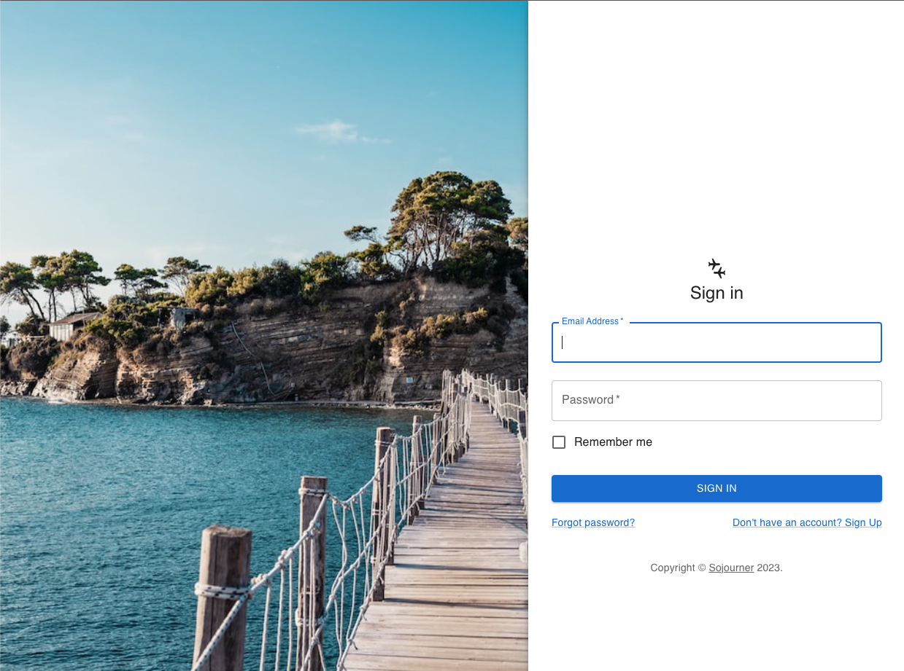

# Sojourner

## Description

- We built this app as a travel planning utility and fun social hangout.

- This app will save users time and data by having one catch-all app where they can see upcoming trips and share travel information and invite friends.

- Our team learned a ton about React components and React routing!  We also learned about using GraphQL which enables some unique queries and quick loading simply designed apps.  Gained exposure to openAI API. 

## Table of Contents 

If your README is long, add a table of contents to make it easy for users to find what they need.

- [Installation](#installation)
- [Usage](#usage)
- [Credits](#credits)
- [License](#license)

## Installation

https://sojourner-app.herokuapp.com/

## Usage

Sample:

## Credits

Jackson Farren (https://github.com/jacksonfarren)

James Porter (https://github.com/JamesJPorter)

Naveed Mahmoudian (https://github.com/naveed-mahmoudian)

Theodore Elgee (https://github.com/gulogulo208)

## Features

Add trip posts, comment on users posts, invite friends to trips, checkout your timeline with friends
